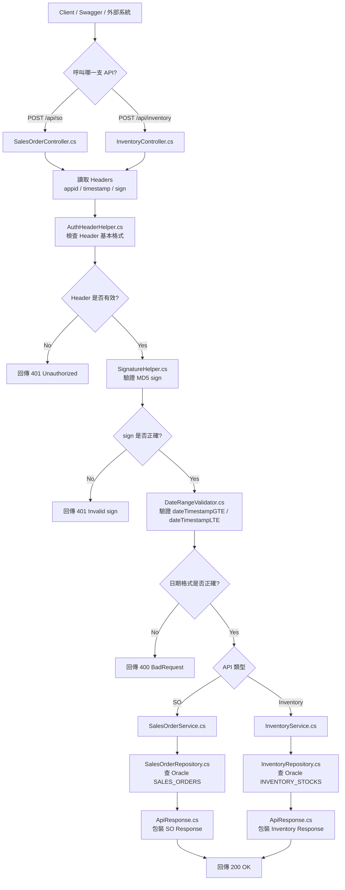
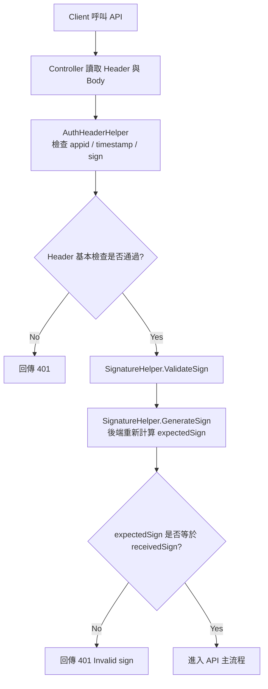

# WEBAPI2026 - SO / Inventory API 串接專案

本專案是依照文件需求建立的 ASP.NET Core Web API，主要提供外部系統查詢：

- `POST /api/so`：銷售表單資料
- `POST /api/inventory`：庫存資料

API 支援：

- `appid / timestamp / sign` Header 驗證
- MD5 sign 驗證
- `dateTimestampGTE / dateTimestampLTE` 時間範圍查詢
- 統一 Response 格式
- Oracle DB 查詢
- Config-based connection string 管理

目前本機已完成 Oracle XE 測試環境串接，資料來源已從 mock data 改為 Oracle 測試表：

- `SYSTEM.SALES_ORDERS`
- `SYSTEM.INVENTORY_STOCKS`

---

## 1. API Overview

### SO API

```http
POST /api/so
```

用途：查詢銷售表單資料。

Response Data 對應欄位：

```text
TransactionID
POSAppleID
InvoiceNumber
TransationTS
MPNID
SerialNumber
TransactionType
UpdateTS
Comments
```

---

### Inventory API

```http
POST /api/inventory
```

用途：查詢庫存資料。

Response Data 對應欄位：

```text
POSAppleID
Date
MPNID
Qty
UpdateTS
```

---

### Debug API

以下 API 只供開發階段測試使用：

```http
POST /api/debug/sign
GET /api/debug/oracle/ping
```

用途：

- `/api/debug/sign`：產生 Swagger 測試用 MD5 sign
- `/api/debug/oracle/ping`：測試 Oracle connection 是否正常

---

## 2. Project Architecture

目前專案架構已從早期 Fat Controller 逐步拆分為：

```text
Controller
→ Service
→ Repository
→ OracleConnection
→ Oracle DB
```

### 主要分層責任

| Layer | 對應資料夾 / 檔案 | 責任 |
|---|---|---|
| Controller | `Controllers/` | 接收 HTTP request、讀取 header/body、回傳 HTTP response |
| Service | `Services/` | 處理業務流程，呼叫 Repository 取得資料 |
| Repository | `Repositories/` | 負責資料來源，目前使用 OracleConnection 查詢 Oracle DB |
| Models / DTOs | `Models/Requests`, `Models/Dtos`, `Models/Responses` | 定義 request、response、Data 欄位格式 |
| Helpers | `Helpers/` | Header 驗證、MD5 sign、日期格式驗證 |
| Data | `Data/OracleConnectionFactory.cs` | 統一建立 OracleConnection |
| Config | `appsettings.json`, `appsettings.Development.json` | 管理 connection string、secretKey 等設定 |

---

## 3. Go 架構對照

如果用 Go backend 的概念理解，目前 C# 架構可對應如下：

| Go 架構 | C# 對應位置 | 責任 | 目前狀態 |
|---|---|---|---|
| `handler` | `Controllers/SalesOrderController.cs`, `Controllers/InventoryController.cs` | 接 HTTP request、讀 body/header、回 response | 已建立 |
| `model / dto` | `Models/Requests`, `Models/Dtos`, `Models/Responses` | 定義 request、response、資料格式 | 已建立 |
| `service` | `Services/SalesOrderService.cs`, `Services/InventoryService.cs` | 處理業務流程，呼叫 Repository | 已建立 |
| `repository` | `Repositories/SalesOrderRepository.cs`, `Repositories/InventoryRepository.cs` | 查詢 Oracle DB 並 mapping DTO | 已建立 |
| `helper / utils` | `Helpers/AuthHeaderHelper.cs`, `SignatureHelper.cs`, `DateRangeValidator.cs` | 共用驗證與工具邏輯 | 已建立 |
| `config` | `appsettings.json`, `IConfiguration` | 管理 SecretKey、DB connection string | 已建立 |

---

## 4. API Flow



---

## 5. MD5 Sign 驗證流程

目前 API 已加入 `appid / timestamp / sign` 的 Header 驗證。

正式呼叫以下 API 前：

```http
POST /api/so
POST /api/inventory
```

需要根據以下資料產生正確的 `sign`：

```text
Request Body
appid
timestamp
secretKey
```

### Sign 產生規則

```text
body 參數依 key 排序
→ 拼接 key=value
→ 拼接 appid / timestamp / secretKey
→ MD5
→ 得到 sign
```

### 驗證流程



---

## 6. Request Body 日期驗證

SO API 和 Inventory API 共用同一組 request body：

```json
{
  "dateTimestampGTE": "2026-04-27 00:00:00",
  "dateTimestampLTE": "2026-04-27 23:59:59"
}
```

驗證規則：

| 欄位 | 必填 | 格式 | 說明 |
|---|---|---|---|
| `dateTimestampGTE` | 是 | `yyyy-MM-dd HH:mm:ss` | 查詢起始時間 |
| `dateTimestampLTE` | 否 | `yyyy-MM-dd HH:mm:ss` | 查詢截止時間，不填則查到目前時間 |

目前由以下檔案負責驗證：

```text
Helpers/DateRangeValidator.cs
```

---

## 7. Oracle Connection String 設定

Oracle 連線資訊由 config 管理。

### `appsettings.json`

`appsettings.json` 只保留範例或 placeholder，不放本機真實密碼。

```json
{
  "ConnectionStrings": {
    "OracleDb": "User Id=YOUR_USERNAME;Password=YOUR_PASSWORD;Data Source=YOUR_HOST:1521/YOUR_SERVICE_NAME;"
  },
  "ApiAuth": {
    "SecretKey": "test-secret-key"
  }
}
```

### `appsettings.Development.json`

本機開發環境可在 `appsettings.Development.json` 放本機 Oracle XE 連線資訊。

```json
{
  "ConnectionStrings": {
    "OracleDb": "User Id=SYSTEM;Password=YOUR_LOCAL_PASSWORD;Data Source=localhost:1521/XEPDB1;"
  }
}
```

`appsettings.Development.json` 不應推上 GitHub，需確認 `.gitignore` 有以下設定：

```gitignore
**/appsettings.Development.json
```

---

## 8. OracleConnectionFactory

Oracle connection 由以下檔案統一建立：

```text
Data/OracleConnectionFactory.cs
```

目前流程：

```text
Repository
→ OracleConnectionFactory
→ 讀取 ConnectionStrings:OracleDb
→ 建立 OracleConnection
→ 查詢 Oracle DB
```

這樣之後 MIS 要切換測試環境或正式環境時，只需要修改主機上的 config connection string，不需要修改 Controller / Service / Repository 的主要流程。

---

## 9. 本機 Oracle 測試表

### SO 測試表

```sql
SYSTEM.SALES_ORDERS
```

對應 API：

```http
POST /api/so
```

欄位 mapping：

```text
TRANSACTION_ID    → TransactionID
POS_APPLE_ID      → POSAppleID
INVOICE_NUMBER    → InvoiceNumber
TRANSATION_TS     → TransationTS
MPN_ID            → MPNID
SERIAL_NUMBER     → SerialNumber
TRANSACTION_TYPE  → TransactionType
UPDATE_TS         → UpdateTS
COMMENTS          → Comments
```

---

### Inventory 測試表

```sql
SYSTEM.INVENTORY_STOCKS
```

對應 API：

```http
POST /api/inventory
```

欄位 mapping：

```text
POS_APPLE_ID  → POSAppleID
STOCK_DATE    → Date
MPN_ID        → MPNID
QTY           → Qty
UPDATE_TS     → UpdateTS
```

---

## 10. SQL Developer 注意事項

在 SQL Developer 新增或修改測試資料後，需要執行：

```sql
COMMIT;
```

否則 Web API 使用另一條 Oracle connection 查詢時，可能看不到剛新增的資料。

---

## 11. 使用 Debug API 產生測試用 sign

正式情境下，`sign` 會由外部系統自行依文件規則產生。

開發階段可使用：

```http
POST /api/debug/sign
```

### Request Body

```json
{
  "dateTimestampGTE": "2026-04-27 00:00:00",
  "dateTimestampLTE": "2026-04-27 23:59:59",
  "appid": "test-app",
  "timestamp": "1538207443910"
}
```

### Response

```json
{
  "Message": "Success",
  "Status": 200,
  "Appid": "test-app",
  "Timestamp": "1538207443910",
  "Sign": "產生出來的MD5sign"
}
```

請複製 `Sign` 的值，並用於正式 API Header。

---

## 12. 測試 SO API

### API

```http
POST /api/so
```

### Headers

```http
appid: test-app
timestamp: 1538207443910
sign: /api/debug/sign 產生的 Sign
Content-Type: application/json
Accept: application/json
```

### Request Body

```json
{
  "dateTimestampGTE": "2026-04-27 00:00:00",
  "dateTimestampLTE": "2026-04-27 23:59:59"
}
```

### 預期 Response

```json
{
  "Message": "Success",
  "Status": 200,
  "Data": [
    {
      "TransactionID": "TXN001",
      "POSAppleID": "POS001",
      "InvoiceNumber": "INV202604270001",
      "TransationTS": "2026-04-27 10:30:00",
      "MPNID": "MPN001",
      "SerialNumber": "SN123456789",
      "TransactionType": "Sale",
      "UpdateTS": "2026-04-27 10:35:00",
      "Comments": ""
    }
  ]
}
```

---

## 13. 測試 Inventory API

### API

```http
POST /api/inventory
```

### Headers

```http
appid: test-app
timestamp: 1538207443910
sign: /api/debug/sign 產生的 Sign
Content-Type: application/json
Accept: application/json
```

### Request Body

```json
{
  "dateTimestampGTE": "2026-04-27 00:00:00",
  "dateTimestampLTE": "2026-04-27 23:59:59"
}
```

### 預期 Response

```json
{
  "Message": "Success",
  "Status": 200,
  "Data": [
    {
      "POSAppleID": "POS001",
      "Date": "2026-04-27",
      "MPNID": "MPN001",
      "Qty": 100,
      "UpdateTS": "2026-04-27 10:35:00"
    }
  ]
}
```

---

## 14. 常見錯誤

### `401 Missing appid header`

原因：Header 沒有帶 `appid`。

---

### `401 Invalid sign`

常見原因：

- `/api/debug/sign` 的 body 和正式 API 的 body 不一致
- `appid` 不一致
- `timestamp` 不一致
- `secretKey` 不一致
- body 內容有修改，但沒有重新產生 sign

---

### `400 dateTimestampGTE format must be yyyy-MM-dd HH:mm:ss`

原因：`dateTimestampGTE` 格式不符合文件要求。

正確格式：

```text
yyyy-MM-dd HH:mm:ss
```

---

### `ORA-01017`

原因：Oracle username / password 錯誤。

請檢查：

```text
appsettings.Development.json
ConnectionStrings:OracleDb
```

---

### API 回傳 `Data: []`

常見原因：

- Oracle 表裡沒有符合 `UPDATE_TS` 時間範圍的資料
- SQL Developer 插入資料後沒有執行 `COMMIT`
- 查詢的 `dateTimestampGTE / dateTimestampLTE` 沒有包含測試資料時間

---

## 15. 正式環境切換方式

正式部署時，MIS 可在主機上調整 config：

```json
{
  "ConnectionStrings": {
    "OracleDb": "User Id=正式帳號;Password=正式密碼;Data Source=正式Host:1521/正式ServiceName;"
  }
}
```

Controller、Service、Repository 不需要因為換環境而修改主要流程。

後續等主管提供正式 SQL 與欄位 mapping 後，主要會修改：

```text
Repositories/SalesOrderRepository.cs
Repositories/InventoryRepository.cs
```

將目前測試用 SQL 替換為正式 SQL。

---

## 16. 待主管 / 對方提供資訊

目前正式環境 DB 無法從本機直接連線，後續會透過 AnyDesk 進入對方內部環境測試。

待提供項目：

```text
1. SO API 正式 SQL
2. Inventory API 正式 SQL
3. 正式資料表與欄位 mapping
4. dateTimestampGTE / dateTimestampLTE 對應的 DB 時間欄位
5. 正式環境 connection string
6. appid / secretKey 正式設定
```

---

## 17. AnyDesk 進場測試 Checklist

進入對方內部環境後，建議依序確認：

```text
1. 確認 appsettings 的 OracleDb connection string
2. 測 GET /api/debug/oracle/ping
3. 測 POST /api/debug/sign
4. 測 POST /api/so
5. 測 POST /api/inventory
6. 確認 response 欄位是否符合文件
7. 確認 SO / Inventory 是否可撈正式資料
8. 確認錯誤情境：Invalid sign / Missing appid / 日期格式錯誤
```