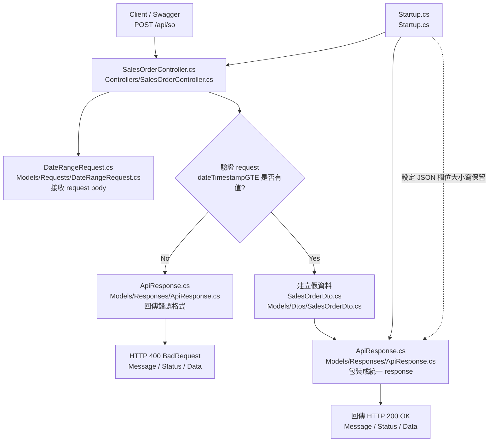
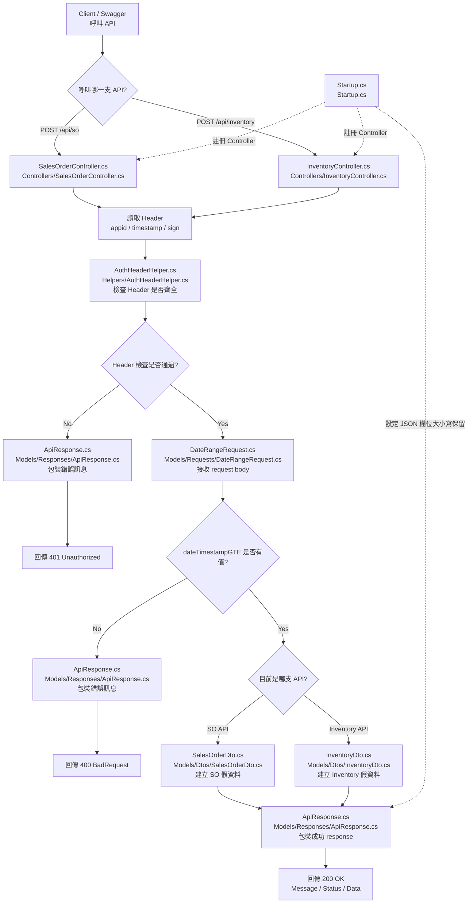
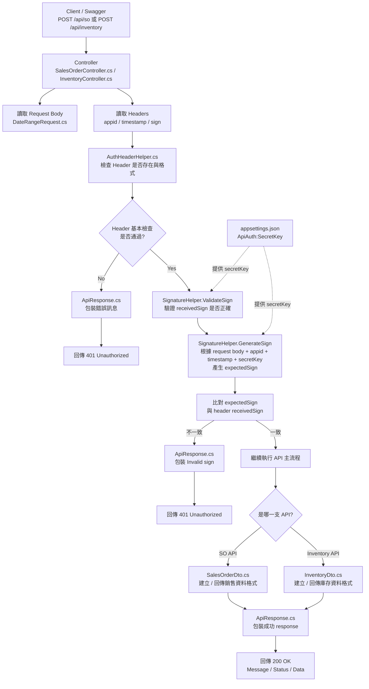


## MD5 Sign 驗證測試流程

目前 API 已加入 `appid / timestamp / sign` 的 Header 驗證。

正式呼叫 `POST /api/so` 或 `POST /api/inventory` 前，需要先根據：

- Request Body
- `appid`
- `timestamp`
- `secretKey`

產生正確的 `sign`。

目前開發階段提供一支 Debug API，方便產生測試用 sign。

---

## 1. 先使用 Debug API 產生 sign

### API

```http
POST /api/debug/sign
```

### Request Body

```json
{
  "dateTimestampGTE": "2026-04-27 00:00:00",
  "dateTimestampLTE": "2026-04-27 23:59:59",
  "appid": "test-app",
  "timestamp": "1538207443910"
}
```

### 說明

這支 Debug API 會根據以下資料產生 sign：

```text
dateTimestampGTE
dateTimestampLTE
appid
timestamp
secretKey
```

其中 `secretKey` 來自：

```text
appsettings.json
```

```json
{
  "ApiAuth": {
    "SecretKey": "test-secret-key"
  }
}
```

---

## 2. Debug API 回傳結果

成功後會回傳類似：

```json
{
  "Message": "Success",
  "Status": 200,
  "Appid": "test-app",
  "Timestamp": "1538207443910",
  "Sign": "產生出來的MD5sign"
}
```

請複製 `Sign` 的值，等等放到正式 API 的 Header 裡。

---

## 3. 使用 sign 測試 SO API

### API

```http
POST /api/so
```

### Headers

```http
accept: application/json
Content-Type: application/json
appid: test-app
timestamp: 1538207443910
sign: Debug API 產生出來的 Sign
```

### Request Body

```json
{
  "dateTimestampGTE": "2026-04-27 00:00:00",
  "dateTimestampLTE": "2026-04-27 23:59:59"
}
```

注意：

`POST /api/so` 的 Request Body 必須和剛才產生 sign 時使用的 body 完全一致。

如果 body、appid、timestamp、secretKey 任一個值不同，sign 都會驗證失敗。

---

## 4. 成功回應

如果 sign 正確，會回傳：

```json
{
  "Message": "Success",
  "Status": 200,
  "Data": [
    {
      "TransactionID": "xxxx",
      "POSAppleID": "POS001",
      "InvoiceNumber": "INV202604270001",
      "TransationTS": "2026-04-27 10:30:00",
      "MPNID": "MPN001",
      "SerialNumber": "SN123456789",
      "TransactionType": "Sale",
      "UpdateTS": "2026-04-27 10:35:00",
      "Comments": ""
    }
  ]
}
```

---

## 5. 失敗情況：Invalid sign

如果 sign 不正確，會回傳：

```json
{
  "Message": "Invalid sign",
  "Status": 401,
  "Data": []
}
```

常見原因：

- `sign` 不是用同一組 body 產生的
- `dateTimestampGTE` 或 `dateTimestampLTE` 和產生 sign 時不同
- `appid` 不一致
- `timestamp` 不一致
- `secretKey` 不一致
- Swagger 預設 body 使用了 `"string"`，但 sign 是用正式日期產生的

---

## 6. 測試重點

目前 sign 驗證流程如下：

```text
Client / Swagger
→ 先呼叫 /api/debug/sign 產生 sign
→ 再呼叫 /api/so
→ Header 帶 appid / timestamp / sign
→ 後端使用同一套規則重新計算 expectedSign
→ 比對 expectedSign 和 receivedSign
→ 相同則回 200 Success
→ 不同則回 401 Invalid sign
```

---

## 7. 注意事項

`/api/debug/sign` 只供開發階段測試使用。

正式環境不應該公開這支 API，避免外部使用者可以直接產生合法 sign。


# 1. SO API 單支流程圖




## File Responsibilities

### `Controllers/SalesOrderController.cs`

- 建立 `POST /api/so` 這支 API。
- 接收 Swagger / 外部系統送進來的 request。
- 驗證 `dateTimestampGTE` 是否有填。
- 決定要回傳成功或錯誤 response。
- 目前先建立假資料，之後會改成查資料庫。

---

### `Models/Requests/DateRangeRequest.cs`

- 定義 SO API 的 request body 格式。
- 對應 `dateTimestampGTE` 和 `dateTimestampLTE`。
- 讓 ASP.NET Core 可以把 JSON body 轉成 C# 物件。
- 對應文檔中的查詢起始時間與截止時間。

---

### `Models/Dtos/SalesOrderDto.cs`

- 定義 SO API 回傳的每一筆銷售資料格式。
- 對應文檔要求的 9 個 SO 欄位。
- 決定 `Data` 陣列裡每一筆資料長甚麼樣子。
- 之後資料庫查出的銷售資料會轉成這個格式。

---

### `Models/Responses/ApiResponse.cs`

- 定義所有 API 的統一 response 格式。
- 包含 `Message`、`Status`、`Data`。
- 成功和錯誤都會用這個格式回傳。
- 讓 API 回傳格式符合文檔要求。

---

### `Startup.cs`

- 註冊 Controller，讓 `SalesOrderController.cs` 可以被 Swagger 和 API routing 找到。
- 啟用 Swagger 測試頁面。
- 設定 JSON 欄位大小寫不要被自動改掉。
- 確保 response 可以維持 `Message / Status / Data` 這種文檔要求的格式。


# API Flow Overview

本專案目前包含兩支主要 API：

- `POST /api/so`：查詢銷售表單資料
- `POST /api/inventory`：查詢每日庫存資料

兩支 API 共用相同的 request / response / header validation 流程，但回傳的 Data DTO 不同。



## Header Signature Validation Flow

