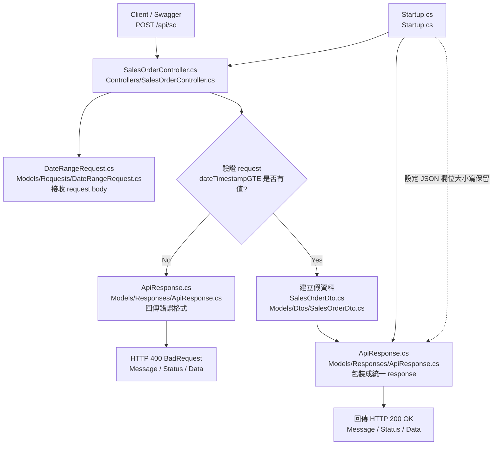



# 1. SO API 單支流程圖



## File Responsibilities

### `Controllers/SalesOrderController.cs`

- 建立 `POST /api/so` 這支 API。
- 接收 Swagger / 外部系統送進來的 request。
- 驗證 `dateTimestampGTE` 是否有填。
- 決定要回傳成功或錯誤 response。
- 目前先建立假資料，之後會改成查資料庫。

---

### `Models/Requests/DateRangeRequest.cs`

- 定義 SO API 的 request body 格式。
- 對應 `dateTimestampGTE` 和 `dateTimestampLTE`。
- 讓 ASP.NET Core 可以把 JSON body 轉成 C# 物件。
- 對應文檔中的查詢起始時間與截止時間。

---

### `Models/Dtos/SalesOrderDto.cs`

- 定義 SO API 回傳的每一筆銷售資料格式。
- 對應文檔要求的 9 個 SO 欄位。
- 決定 `Data` 陣列裡每一筆資料長甚麼樣子。
- 之後資料庫查出的銷售資料會轉成這個格式。

---

### `Models/Responses/ApiResponse.cs`

- 定義所有 API 的統一 response 格式。
- 包含 `Message`、`Status`、`Data`。
- 成功和錯誤都會用這個格式回傳。
- 讓 API 回傳格式符合文檔要求。

---

### `Startup.cs`

- 註冊 Controller，讓 `SalesOrderController.cs` 可以被 Swagger 和 API routing 找到。
- 啟用 Swagger 測試頁面。
- 設定 JSON 欄位大小寫不要被自動改掉。
- 確保 response 可以維持 `Message / Status / Data` 這種文檔要求的格式。


# API Flow Overview

本專案目前包含兩支主要 API：

- `POST /api/so`：查詢銷售表單資料
- `POST /api/inventory`：查詢每日庫存資料

兩支 API 共用相同的 request / response / header validation 流程，但回傳的 Data DTO 不同。

```mermaid
flowchart TD
    A[Client / Swagger<br/>呼叫 API] --> B{呼叫哪一支 API?}

    B -->|POST /api/so| C[SalesOrderController.cs<br/>Controllers/SalesOrderController.cs]
    B -->|POST /api/inventory| D[InventoryController.cs<br/>Controllers/InventoryController.cs]

    C --> E[讀取 Header<br/>appid / timestamp / sign]
    D --> E

    E --> F[AuthHeaderHelper.cs<br/>Helpers/AuthHeaderHelper.cs<br/>檢查 Header 是否齊全]
    F --> G{Header 檢查是否通過?}

    G -->|No| H[ApiResponse.cs<br/>Models/Responses/ApiResponse.cs<br/>包裝錯誤訊息]
    H --> I[回傳 401 Unauthorized]

    G -->|Yes| J[DateRangeRequest.cs<br/>Models/Requests/DateRangeRequest.cs<br/>接收 request body]

    J --> K{dateTimestampGTE 是否有值?}

    K -->|No| L[ApiResponse.cs<br/>Models/Responses/ApiResponse.cs<br/>包裝錯誤訊息]
    L --> M[回傳 400 BadRequest]

    K -->|Yes| N{目前是哪支 API?}

    N -->|SO API| O[SalesOrderDto.cs<br/>Models/Dtos/SalesOrderDto.cs<br/>建立 SO 假資料]
    N -->|Inventory API| P[InventoryDto.cs<br/>Models/Dtos/InventoryDto.cs<br/>建立 Inventory 假資料]

    O --> Q[ApiResponse.cs<br/>Models/Responses/ApiResponse.cs<br/>包裝成功 response]
    P --> Q

    Q --> R[回傳 200 OK<br/>Message / Status / Data]

    S[Startup.cs<br/>Startup.cs] -. 註冊 Controller .-> C
    S -. 註冊 Controller .-> D
    S -. 設定 JSON 欄位大小寫保留 .-> Q


## File Responsibilities

### `Controllers/SalesOrderController.cs`
- 提供 `POST /api/so`
- 讀取 Header 與 request body
- 驗證 Header 與 `dateTimestampGTE`
- 建立 SO 假資料並回傳

### `Controllers/InventoryController.cs`
- 提供 `POST /api/inventory`
- 讀取 Header 與 request body
- 驗證 Header 與 `dateTimestampGTE`
- 建立 Inventory 假資料並回傳

### `Helpers/AuthHeaderHelper.cs`
- 檢查 `appid`、`timestamp`、`sign`
- 檢查 `timestamp` 是否為 13 位數字
- 驗證失敗時回傳錯誤訊息

### `Models/Requests/DateRangeRequest.cs`
- 定義 request body 格式
- 對應 `dateTimestampGTE`、`dateTimestampLTE`

### `Models/Dtos/SalesOrderDto.cs`
- 定義 SO API 的 `Data` 每筆資料格式

### `Models/Dtos/InventoryDto.cs`
- 定義 Inventory API 的 `Data` 每筆資料格式

### `Models/Responses/ApiResponse.cs`
- 定義統一 response 格式
- 包含 `Message`、`Status`、`Data`

### `Startup.cs`
- 註冊 Controller
- 啟用 Swagger
- 保留 JSON 欄位大小寫格式