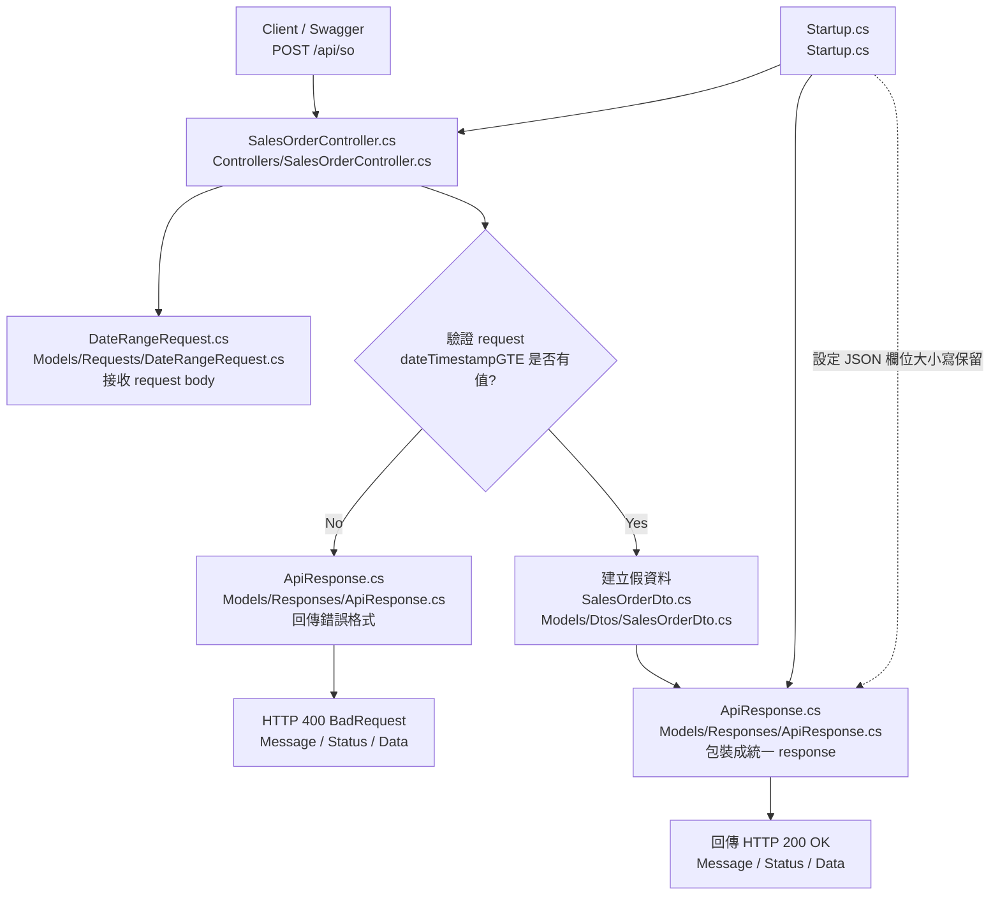



# 1. 流程圖

## File Responsibilities

### `Controllers/SalesOrderController.cs`

- 建立 `POST /api/so` 這支 API。
- 接收 Swagger / 外部系統送進來的 request。
- 驗證 `dateTimestampGTE` 是否有填。
- 決定要回傳成功或錯誤 response。
- 目前先建立假資料，之後會改成查資料庫。

---

### `Models/Requests/DateRangeRequest.cs`

- 定義 SO API 的 request body 格式。
- 對應 `dateTimestampGTE` 和 `dateTimestampLTE`。
- 讓 ASP.NET Core 可以把 JSON body 轉成 C# 物件。
- 對應文檔中的查詢起始時間與截止時間。

---

### `Models/Dtos/SalesOrderDto.cs`

- 定義 SO API 回傳的每一筆銷售資料格式。
- 對應文檔要求的 9 個 SO 欄位。
- 決定 `Data` 陣列裡每一筆資料長甚麼樣子。
- 之後資料庫查出的銷售資料會轉成這個格式。

---

### `Models/Responses/ApiResponse.cs`

- 定義所有 API 的統一 response 格式。
- 包含 `Message`、`Status`、`Data`。
- 成功和錯誤都會用這個格式回傳。
- 讓 API 回傳格式符合文檔要求。

---

### `Startup.cs`

- 註冊 Controller，讓 `SalesOrderController.cs` 可以被 Swagger 和 API routing 找到。
- 啟用 Swagger 測試頁面。
- 設定 JSON 欄位大小寫不要被自動改掉。
- 確保 response 可以維持 `Message / Status / Data` 這種文檔要求的格式。